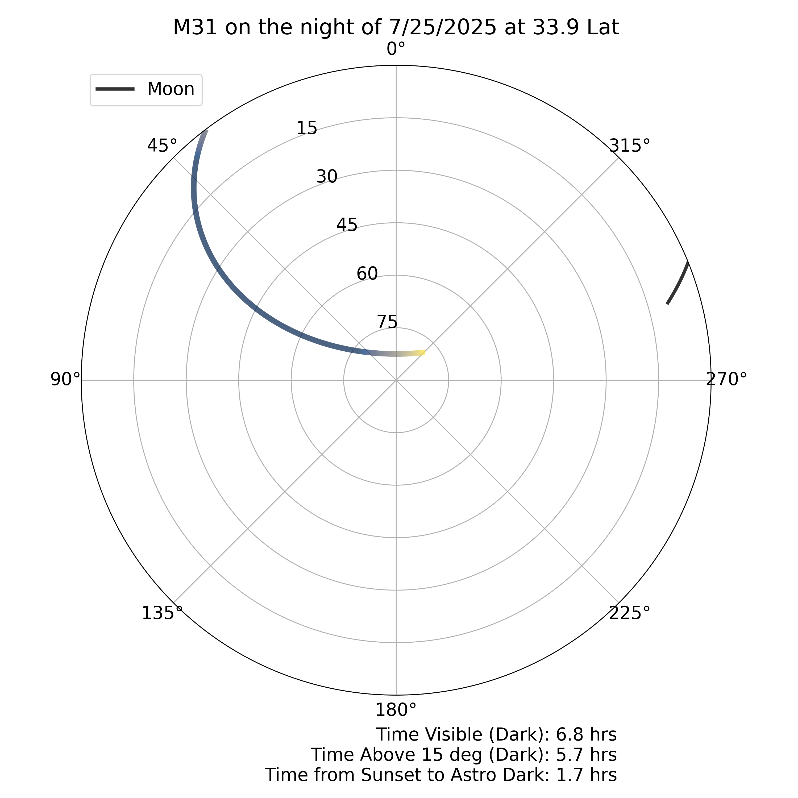

# Astro Object Planning Tool
Download and install Python from: https://www.python.org/downloads/windows/.  
Ensure Python is added to PATH during installation.

Ensure that modules are installed per requirements.txt. This can either be done running 
```
pip install -r requirements.txt 
```
The tool is run from the command line, likely by running
```
py ./object_altitude_tool -n <object name> -l <observer latitude> -d <observation date MM/DD/YYYY>
```
You can optionally specify how the object's altitude will be projected onto a polar grid, but it will default to linear, which I think looks the best.

The code requires an internet connection to run to get object coordinates from a database.

Here is an example image generated by the code:

